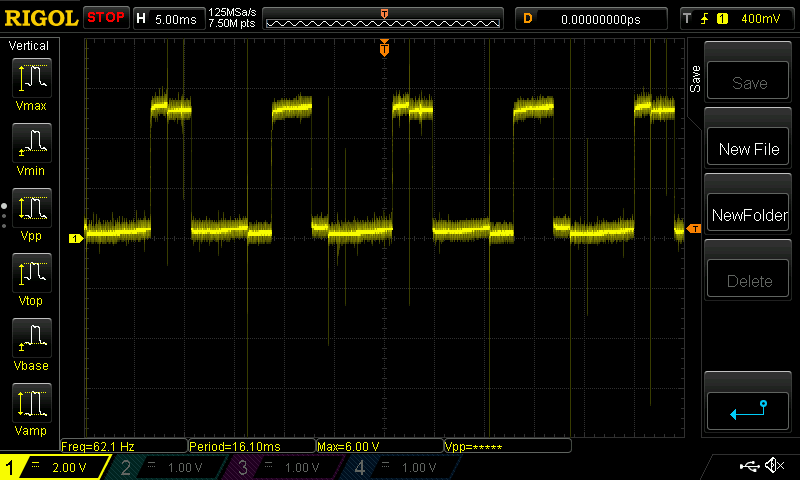

# Arduino-Tachometer
Finally getting around to that stray tachometer lead hanging around in the engine bay. As I don't have an oscilloscope and this cable goes for a wild, insulated ride, I don't know if it's carrying a sine wave from the alternator, or a square wave from the ECU. If its a sine wave, I'll probably just throw it into a comparator Op-amp. w/ +5V and 0V in. Might also have to get Schmitty but that's easy. I can even build one if I want to spend forever doing any of the following: measuring betas, swap-test emitter resistors to increase base bias of second BJT, or throw a pot in to be done with it.

## Oh the Places You'll Go
- Dr. Seuess on programming. Probably.

# Alright.

So I broke down and got an oscilloscope. It's a true babe, trust me. Or don't - I won't lose sleep over it, promise. After forgetting to change the input to 1x (seriously, why is 10x default?) and pondering what I'm going to about a 144V square wave, I've finally gotten a look at what I'm working with. Looks more promising than I originally thought at least.  
I had a tussle with the USB stick, but without further ado... pictures!

Here is the idle RPM wave form:  

Here's a ~2k RPM:

This one was loud enough to scare me as I was manually actuating the throttle body. (At least I had eye protection, right? Thanks, pops.)

So a few things are immediately noticeable. First, see the Vmax in the first picture? It says ~8V. The V/div is at 2V/div, so you can see for yourself that the signal is sitting around 6V. Is the oscilloscope wrong? No, it's just erratic. Not a huge problem since the meat of the signal is sitting at 6V, I just need to make sure I don't blow a transistor or related IC with the bumps.

Something more annoying than floating voltage levels is the tiny hair-like spikes of a signal that show up in all the pictures. There is actually a huge one in the dead center of the idle RPM and might even be what the scope is measuring 8.5V from. Now noise will always be a huge problem in an engine bay since there are ~~antennas~~ cables lining a metal cage (at least Faraday is on our side) that surrounds a whirling metal block of explosive death. Pretty great way to hose down an area in a wide variety of weak signals. For once I wish I was actually working with a pure FM sine wave because I could easily choke/isolate that signal and then convert it to something that accurately and reliably triggers a FET with a few robust components. However, I'm given the square wave and the whole famn damily of sine waves in tow. So something like an RF choke or a parallel cap to drain off high frequencies will have to effect of boxing the ears of my lovely square wave the ECU made for me. I still might do it, mind you since a tiny cap shunt (think a puff) would be a fraction of a cent in parts and, if ceramic, function splendidly in a hot engine bay. I could get away with something like a tiny cap largely because of how quickly the noise appears and disappears. Since it's not reliably frequency dependent, the usual method of looking at impedance as a function of radial frequency only hints at the right answer. If you want real numbers, use the derivative definition of voltage and current. Mayhaps I will do a math post on that later just to see exactly where the cutoff would be.  
Anyhow, tiny blips = supah derivatives \therefore \!\, easy to filter.

Off one tangent onto another: the original code was not being qwoperative (if you don't understand the spelling, I encourage you to try your hand at [qwop](http://www.qwop.me/qwop/)) because I was assuming the RPMs would be, within a rough order of magnitude, in the thousands. At best, divided by 4 to account for the 4-stroke engine. However, the dirty dogs at AMC knew their chops and threw me a curve ball. The idle f is a whopping **42** RPMS! Weird shit. So when I divided the float containing the read RPMs by 100, it gave up on it's will to live and became a 1 or 0. So nothing happened (there's a check for out-of-index addresses - which, thankfully a uint16_t is way outside of 59 at max). Now why is this good? 42Hz might as well be DC. A nth order harmonic is still likely to be high enough that a 1pF cap has marginal effects. Still, easy enough to check with a scope.

There are still many weird things I could blab on about but instead I'll attempt to finish with the strange characteristics. The duty cycle of this wave appears to be closer to 1/3 than 1/2 -- which the FreqMeasure lib warns against. Though I'd rather have an undersquare duty cycle than an oversquare, honestly.(I really want to talk about potato cannons now. I had such a good idea earlier. Yay compressed air!) That is not the only strange thing though, some of the waves have these strange artefacts where they'll be split along regular lines. If you scroll up to the last picture it'll be very obvious. The interesting thing is that they are very regular and almost identical in period regardless of the larger square wave that they are mixed in with.

That just gave me a great idea, actually. If only I had a spectrum analyzer. So I've been assuming this is some square wave generated from a RC T-net (or mayhaps a more sophisticated method) but it's coming from the ECU. Now I don't know much about the ECU in specific but it performs calculations so it's 99% running on TTL logic levels *and* a base clock. The base clock is what made me think of the weird, regular noise spikes. What's an easy way to make a square wave? Turn a digital write on and off. I wish I had zoomed in on a corner of a wave while I was doing this but it should have little warbly spikes if it is made of harmonics and a digital signal is much cleaner. Ish. Building on this, if the subroutine for the tach checks in with every x cycles to write the logic level to the tach lead then it would show spikes just like these. Which is great, because if that is true I would just filter it and call it a day. It's just DC otherwise so why not (well you could make an argument about rise times suffering from being filtered but whatever).

I could also just look at how a tachometer for these engines is usually made. But that is no fun so it won't do.

Bad math estimation time:  
If it is at 42Hz @ 700RPM, that's a convenient 6Hz/100RPM ratio. At 5600 redline, it ~should be 336Hz. That's still practically DC.  
So the code should easily reflect this by changing rpm / 100 -> rpm / 6. Woo!

UPDATE: Concerning active regions of the FETs on the ATmega328, they're actually quite generous. The inactive region lasts until a whopping 1.5V and turns on at 3V.  
However, the absolute max voltage is 6V. So I'm going to have to tone down the signal a bit. Interestingly, the power source of the Arduino is used as VCC reference. So if it is running on a dying battery, HIGH will be a lower value than when the battery was full. Good to know. (Assuming that info can be trusted...)

## Musings

I suspect the arduino will do almost all of the work in terms of circuitry. Power and pull-up/pull-down resistors are just about the only things needed, I think. Powering the arduino and display from a battery seems like a non-ideal way to go about things but I need to see what kind of power the car battery can provide. A serialized LED display will probably not tax the battery too hard but I will probably have to regulate the voltage some how due to the fact that the cold battery provides less voltage than when the alternator is charging it. A voltage follower could prove to be a nice way to transform the battery into a semi-supply. Really I just need to figure out how much SC current the battery can provide, or the internal resistance. I also have no idea what kind of output impedance the battery has, so that makes a voltage follower that much more attractive.

As a side note (one of many), the Edison looks rather interesting. It could be a lot of fun to program it outside of the Arduino IDE as it doesn't need much more than the Intel/Atom Eclipse loaf to hit play. (I suppose the sdk/dev chain and g++ would be just as good but Eclipse would handle lib updates and linking. GDB practice would be nice though.)  I've never done programming for and ADC interface but I mean, come on. A square wave is practically the ideal output for the D side of the ADC and it happens to also be on the A side. Hardware addresses.
Musings on musings. On musings.  

So the code is actually largely done other than fitting some real-life things to ideal code and maybe error handling+checks. The work I have left to do is probably all analog and IC components. I might have to make an amplifier for the signal and then convert to square. Though let's be honest here, I don't care about how pretty the resulting sine wave is so long as I can keep track of the accuracy of the positive logic level timing. Which means I can do damn well as much as I please concerning the amplifier. I don't even need the -wave so I can let it clip provided. I don't swing it so hard it goes into reverse-conduction/breakdown.  
Which means the uber simple solution is to throw a schmitt trigger into a comparator with 0V & +5V supply voltages. I maintain the timing, ignore the diode drops, get my boosted square wave out as if from a voltage follower, and could drive the base with damn near any signal.

God I wish I had an oscilloscope.  
Here I am going "yeah, a vortex tube would be sick! I could cool my beer with the dying wishes of prehistoric reptiles as they combust in 4L of fury. That's worth $180+ fo sho'." Meanwhile... nice entry-level oscilloscope: $300, could use on countless projects for years. Too damn expensive.  
I don't know why that is in a README. Luxury of nobody looking at your work I suppose.

## Wave Assumptions

I believe the square wave is a tick for every revolution. But since this - and most - engines are 4-stroke, I need to figure out what a tach normally thinks of as one revolution.

## Initial Code Ideas

Basically for the meat and 'taters of the program, it will probably be a simple loop that watches the square wave inputs' rising edge and increments a counter every time it sees it. Using the internal oscillator as refrence, I can keep track of how long the counter has been incrementing and normalize to a second or minute, and then divide for RPM.
The issue that I will probably come up against is accurately determining how long the loop has been running and sending the serialized output to the display wihtout hanging the program. Fortunately, an '84 Jeep has dogshit acceleration, so I have a lot of slack to work with regarding timing.

## Expansion

I may have to ditch the arduino earlier rather than later in favor of parallel processes/threading for timing+counting and serializing+displaying. I believe this is possible in an R-Pi but I'd have to actually check.
The primary reason for an eventual RPi change is for my sound-system upgrade and wireless charging in the car that turns on when a phone/tablet is placed on or over the pad.
I'm not starting with the RPI because it is overkill at the moment (probably), has steeper power requirements, and is more unfamiliar to me in terms of programming.
In a perfect world, I'd learn how to program an Intel Edison and go the module route with boiler-plate code so I don't have to drag things like a stripped-down raspbian but I barely even know where to begin with something like that.

## Why Are There Multiple Files?

Let me tell you, dear Deter.  
Long story short, I don't have an LCD screen on hand but I *do* have an Adafruit 60LED/m strip.  
So after hashing out a nice way to run the strip from the 5V PWM 6 pin on an Arduino in /NeoPixel-Playtime/src/neopixel_learnin/ and adjust the brightness of the previous pins, I have returned to conquer the tachometer.  
Which is honestly a completely different thing.  

### LCD
Now, in the `LCD` directory I will have the LCD screen implementation. Eventually.  

### LED

In the `LED` directory I will have the LED-strip implementation.

Needs [Adafruit's NeoPixel Library](https://github.com/adafruit/Adafruit_NeoPixel) to function.

With 60 LEDs per meter, I can have - among other things - the longest tachometer in the world (really puts the *meter* in tacho*meter*, ehh? Got 'em!), and 1 LED equal to 100 RPMs. The 242 a.k.a. 4.0L, his holiness, the king of running on dirt, AMC Straight-6 has a limiter at 5.6k RPMs so I can easily fit the whole range on the strip. I plan on color-coding the LEDs to go from green->yellow->red so it has some reference and swag points.  
(Side note: I'm not sure I'll actually ever run this thing as a daily, that would take a bit o' work to shorten it to less than a meter. Though maybe a meter strip on the dash would be cool. Who knows.)  
If I did ever decide to run this regularly, I would have to sample a nob or something to dim the blindingly-bright LEDs at night. And a proper relay/switch control.

One thing I might consider is leaving lighthouse pixels every 1k rpm or some such to denote how deep in the paint you are. I also just really want to use the pretty blue LED. I could ditch yellow for blue to cut back on one of the active LEDs, which in a perfect world would cut the power requirements in half but I doubt that is true here. I mean, this is the digital world so everything is assumed to be a perfect flower and if anything goes wrong it's a manufacturers defect.

### Binary LED

An idea for trimming down LEDs needed. I imagine this program would have a lot of #defines but be rather simple. with a byte I could easily express the thousands and hundreds places. In fact, I would only need 3 bits for the thousand since I don't need to go above 5 (6 is free).
